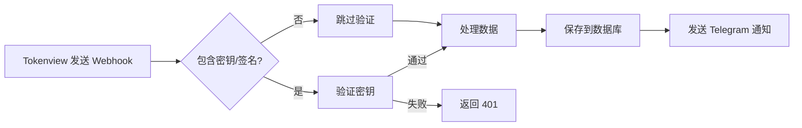

# Tokenview Webhook 密钥配置

## 🔑 你的密钥信息

**Webhook Secret（密钥）：**
```
fSpkcrSkEMrMOxY65gr0
```

⚠️ **重要：请妥善保管此密钥，不要泄露给他人！**

## 📝 配置步骤

### 第1步：添加环境变量到 Vercel

1. 访问 Vercel Dashboard：https://vercel.com/dashboard
2. 进入你的项目（newdapp-master）
3. 点击 **Settings** → **Environment Variables**
4. 添加新的环境变量：

| 名称 | 值 | 环境 |
|------|-----|------|
| `TOKENVIEW_WEBHOOK_SECRET` | `fSpkcrSkEMrMOxY65gr0` | Production, Preview, Development |

### 第2步：保存并重新部署

1. 点击 **Save** 保存环境变量
2. 在 Vercel Dashboard 点击 **Redeploy** 重新部署项目
3. 等待部署完成（约1-2分钟）

### 第3步：本地开发配置（可选）

如果需要在本地测试，创建或更新 `.env.local` 文件：

```bash
# .env.local
TOKENVIEW_WEBHOOK_SECRET=fSpkcrSkEMrMOxY65gr0
```

**注意：** `.env.local` 应该在 `.gitignore` 中，不要提交到 Git！

## ✅ 验证配置

### 方法1：查看 Vercel 日志

1. 在 Vercel Dashboard 点击 **Logs**
2. 发送测试 webhook
3. 查看日志中是否有：
   ```
   🔐 验证 Tokenview 签名
   ✅ API Key 验证成功
   ```

### 方法2：测试 Webhook

在 Tokenview Dashboard 中点击 "Test" 按钮，应该看到成功响应。

## 🔒 安全最佳实践

### 1. 密钥保护
- ✅ 存储在环境变量中
- ✅ 不要硬编码在代码中
- ✅ 不要提交到 Git
- ✅ 不要分享给他人

### 2. 访问控制
- 只有你的 Vercel 账号可以查看密钥
- 定期检查有权访问的人员

### 3. 如果密钥泄露
1. 立即在 Tokenview Dashboard 重新生成密钥
2. 更新 Vercel 环境变量
3. 重新部署项目

## 📊 密钥验证流程



## 🎯 配置完成检查清单

- [ ] 已在 Vercel 添加环境变量 `TOKENVIEW_WEBHOOK_SECRET`
- [ ] 密钥值正确：`fSpkcrSkEMrMOxY65gr0`
- [ ] 已重新部署项目
- [ ] 已在 Tokenview 测试 webhook
- [ ] 查看 Vercel 日志确认工作正常
- [ ] 已将密钥保存到安全的地方（如密码管理器）

## 🔧 故障排查

### Webhook 验证失败

1. **检查环境变量名称**
   - 必须是 `TOKENVIEW_WEBHOOK_SECRET`（区分大小写）

2. **检查密钥值**
   - 确保没有多余的空格
   - 确保复制完整：`fSpkcrSkEMrMOxY65gr0`

3. **确认已重新部署**
   - 修改环境变量后必须重新部署
   - 在 Vercel Dashboard 点击 "Redeploy"

4. **查看日志**
   ```bash
   # 使用 Vercel CLI
   vercel logs --follow
   ```

### 签名验证问题

如果遇到签名验证失败：

1. 检查 Tokenview 文档了解签名算法
2. 暂时注释掉签名验证代码
3. 先确保基本功能正常
4. 再根据文档实现正确的签名验证

## 📞 获取帮助

- Tokenview 文档：https://services.tokenview.io/docs
- Tokenview 支持：通过 Dashboard 联系客服
- Vercel 文档：https://vercel.com/docs/environment-variables

## 📝 记录

- **密钥生成时间：** 2025-10-11
- **配置人员：** Alex
- **项目：** newdapp-master
- **Webhook URL：** https://ethmax.vercel.app/api/tokenview/webhook

---

**⚠️ 重要提醒：**
此文件包含敏感信息，请确保：
1. 不要提交到公共 Git 仓库
2. 定期更换密钥
3. 只与授权人员分享

