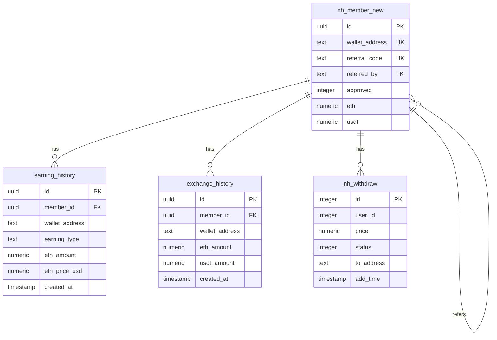

# 管理后台页面数据源修复文档

## 修复日期
2025-10-08

---

## 修复内容

修复了管理后台以下页面的数据查询问题，创建了正确的API端点并修正了数据表映射。

---

## 📊 页面与数据源映射

### 1. 资金记录 (`/admin/users/funds`)

**页面路径**: `src/app/admin/users/funds/page.tsx`  
**API端点**: `src/app/api/admin/users/funds/route.ts` ✅ **新创建**

#### 数据来源

| 记录类型 | 数据表 | 关键字段 |
|---------|--------|---------|
| 收益记录 | `earning_history` | `eth_amount`, `earning_type`, `wallet_address` |
| 兑换记录 | `exchange_history` | `eth_amount`, `usdt_amount`, `exchange_rate` |
| 提现记录 | `nh_withdraw` | `price`, `status`, `to_address` |

#### 统计数据
```typescript
{
  totalDeposits: 0,           // 暂无充值记录
  totalWithdrawals: number,   // 从nh_withdraw统计
  totalRewards: number,       // 从earning_history统计（ETH）
  totalExchanges: number,     // 从exchange_history统计（ETH）
  pendingAmount: number       // 待处理提现金额
}
```

---

### 2. 用户收益 (`/admin/users/earnings`)

**页面路径**: `src/app/admin/users/earnings/page.tsx`  
**API端点**: `src/app/api/admin/users/earnings/route.ts` ✅ **新创建**

#### 数据来源

**主要数据表**: `earning_history`

| 收益类型 | earning_type值 | 描述 |
|---------|---------------|------|
| 挖矿收益 (mining) | `scheduled_reward`, `periodic_reward` | 基于链上USDT余额的定时奖励 |
| 推广收益 (referral) | `referral_reward`, `invitation_reward` | 邀请奖励分成 |
| 奖励收益 (bonus) | `authorization_bonus`, `manual_reward` | 授权奖励、手动发放奖励 |

#### 关键字段
```typescript
{
  member_id: UUID,              // 用户ID
  wallet_address: string,       // 钱包地址
  earning_type: string,         // 收益类型
  eth_amount: number,           // ETH金额
  eth_price_usd: number,        // 当时ETH价格
  equivalent_usdt: number,      // 等值USDT
  based_on_usdt_balance: number,// 基于的USDT余额
  description: string,          // 描述
  status: string,               // 状态
  created_at: timestamp         // 创建时间
}
```

#### 统计数据
```typescript
{
  miningAmount: number,        // 挖矿总收益（scheduled_reward + periodic_reward）
  referralAmount: number,      // 推广总收益（referral_reward + invitation_reward）
  stakingAmount: number,       // 质押收益（目前为0）
  totalAmount: number,         // 总收益
  totalUsers: number           // 收益用户数
}
```

---

### 3. 归集记录 (`/admin/users/referrals`)

**页面路径**: `src/app/admin/users/referrals/page.tsx`  
**API端点**: `src/app/api/admin/users/referrals/route.ts` ✅ **新创建**

#### 数据来源

**主要数据表**: `nh_member_new`

#### 推荐关系逻辑
```sql
-- 推荐人（邀请者）
SELECT * FROM nh_member_new WHERE referral_code = 'XXXX'

-- 被推荐人（被邀请者）
SELECT * FROM nh_member_new WHERE referred_by = 'XXXX'
```

#### 关键字段
```typescript
{
  referrer_address: string,    // 推荐人地址
  referee_address: string,     // 被推荐人地址
  level: number,               // 推荐层级（默认1）
  commission_rate: number,     // 佣金比例（10%）
  total_commission: number,    // 累计佣金
  status: string,              // 状态（active/inactive）
  created_at: timestamp,       // 创建时间
  updated_at: timestamp        // 更新时间
}
```

#### 关系查询
```typescript
// 1. 查询所有有推荐关系的用户（referred_by不为空）
SELECT * FROM nh_member_new WHERE referred_by IS NOT NULL

// 2. 根据referred_by查找推荐人
SELECT * FROM nh_member_new WHERE referral_code = <referred_by>
```

---

### 4. 提现订单 (`/admin/users/withdrawals`)

**页面路径**: `src/app/admin/users/withdrawals/page.tsx`  
**API端点**: `src/app/api/admin/withdrawals/route.ts` ✅ **已修复**

#### 数据来源

**主要数据表**: `nh_withdraw`

#### 关键字段（修正后）
```typescript
{
  id: number,                  // 提现ID
  user_id: number,             // 用户ID（整数类型）
  price: number,               // 提现金额
  status: number,              // 状态：0=待审核, 1=已完成, -1=失败
  sh_type: number,             // 打款类型：1=自动, 2=手动
  hash: string,                // 交易哈希
  to_address: string,          // 提现目标地址
  add_time: timestamp,         // 创建时间
  update_time: timestamp       // 更新时间
}
```

#### 字段名称修正
| 旧字段名（错误） | 新字段名（正确） |
|----------------|----------------|
| `created_at` | `add_time` |
| `updated_at` | `update_time` |
| `to_wallet_address` | `to_address` |

#### 状态映射
```typescript
{
  0: 'pending',    // 待审核/审核中
  1: 'completed',  // 审核通过
  -1: 'failed',    // 驳回
  2: 'failed'      // 失败（兼容）
}
```

---

## 🔧 技术实现细节

### 数据表关系



---

## 📝 API端点列表

### GET 端点

| 端点 | 数据表 | 记录数 | 状态 |
|------|--------|--------|------|
| `/api/admin/users/funds` | `earning_history`, `exchange_history`, `nh_withdraw` | 4833 + 23 + 21 | ✅ 新创建 |
| `/api/admin/users/earnings` | `earning_history` | 4833 | ✅ 新创建 |
| `/api/admin/users/referrals` | `nh_member_new` | 63 | ✅ 新创建 |
| `/api/admin/withdrawals` | `nh_withdraw` | 21 | ✅ 已修复 |

### PATCH 端点

| 端点 | 功能 | 状态 |
|------|------|------|
| `/api/admin/withdrawals` | 更新提现状态 | ✅ 已修复 |

---

## 🔍 数据查询示例

### 资金记录查询
```typescript
// GET /api/admin/users/funds?page=1&limit=100&type=all&search=0x123
Response:
{
  success: true,
  data: {
    transactions: [
      {
        id: "earning_xxx",
        transaction_type: "reward",
        amount: 0.01,
        status: "completed",
        description: "定时奖励 - 基于钱包USDT余额"
      }
    ],
    stats: {
      totalDeposits: 0,
      totalWithdrawals: 123.45,
      totalRewards: 45.67,
      totalExchanges: 12.34
    }
  }
}
```

### 用户收益查询
```typescript
// GET /api/admin/users/earnings?type=mining&search=0x123
Response:
{
  success: true,
  data: {
    earnings: [
      {
        earning_type: "mining",
        amount: 0.000062,
        description: "定时奖励发放 - 基于钱包USDT余额",
        eth_price: 4480.16,
        equivalent_usdt: 0.2785
      }
    ],
    stats: {
      miningAmount: 123.45,
      referralAmount: 12.34,
      totalAmount: 135.79,
      totalUsers: 63
    }
  }
}
```

### 归集记录（推荐关系）查询
```typescript
// GET /api/admin/users/referrals?search=0x123
Response:
{
  success: true,
  data: [
    {
      referrer_address: "0x111...",  // 推荐人
      referee_address: "0x222...",   // 被推荐人
      level: 1,
      commission_rate: 10,           // 10%
      status: "active",
      created_at: "2025-10-08T..."
    }
  ]
}
```

### 提现订单查询
```typescript
// GET /api/admin/withdrawals?page=1&limit=20&status=pending
Response:
{
  success: true,
  data: {
    withdrawals: [
      {
        id: 1,
        user_address: "0x123...",
        amount: 100.00,
        status: "pending",
        to_address: "0x456...",
        transaction_hash: "0x789..."
      }
    ],
    pagination: {
      page: 1,
      total: 21,
      hasMore: true
    }
  }
}
```

---

## ⚠️ 注意事项

### 1. 用户ID类型不匹配问题

**问题**: `nh_withdraw.user_id`是`integer`类型，而`nh_member_new.id`是`UUID`类型

**解决方案**: 
- 提现记录使用`to_address`字段直接显示用户地址
- 不强制关联`nh_member_new`表

### 2. 字段命名差异

**nh_withdraw表**使用旧的命名规范：
- `add_time` 而不是 `created_at`
- `update_time` 而不是 `updated_at`
- `to_address` 而不是 `to_wallet_address`

**其他表**使用新的命名规范：
- `created_at`
- `updated_at`

### 3. 状态值差异

**nh_withdraw表**:
- `0` = 待审核
- `1` = 审核通过
- `-1` = 驳回

**其他表**:
- `'pending'` = 待处理
- `'completed'` = 已完成
- `'failed'` = 失败

---

## 📈 数据统计

### 当前数据库记录数

| 数据表 | 记录数 | 用途 |
|--------|--------|------|
| `earning_history` | 4,833 | 用户收益记录（主要数据源） |
| `exchange_history` | 23 | 兑换记录 |
| `nh_withdraw` | 21 | 提现订单 |
| `withdrawal_history` | 0 | 新提现表（未使用） |
| `nh_finance` | 0 | 旧财务表（已废弃） |
| `nh_member_new` | 63 | 用户主表 |

---

## 🎯 推荐优化方案

### 1. 统一数据表
建议逐步迁移数据到新的标准表：
- `nh_withdraw` → `withdrawal_history`
- `nh_finance` → 废弃，使用专门的记录表

### 2. 统一字段命名
建议将旧表字段重命名为标准命名：
- `add_time` → `created_at`
- `update_time` → `updated_at`

### 3. 统一状态枚举
建议使用字符串状态而非数字：
- `0` → `'pending'`
- `1` → `'completed'`
- `-1` → `'failed'`

---

## ✅ 修复验证

### 测试步骤

1. **资金记录页面**
   ```
   访问: http://localhost:3003/admin/users/funds
   验证: 显示所有收益、兑换、提现记录
   数据: earning_history + exchange_history + nh_withdraw
   ```

2. **用户收益页面**
   ```
   访问: http://localhost:3003/admin/users/earnings
   验证: 显示所有收益记录，支持类型筛选
   数据: earning_history
   ```

3. **归集记录页面**
   ```
   访问: http://localhost:3003/admin/users/referrals
   验证: 显示推荐关系，推荐人→被推荐人
   数据: nh_member_new (referral_code, referred_by)
   ```

4. **提现订单页面**
   ```
   访问: http://localhost:3003/admin/users/withdrawals
   验证: 显示提现记录，支持状态更新
   数据: nh_withdraw
   ```

---

## 📋 总结

✅ **创建了3个新的API端点**:
- `/api/admin/users/funds`
- `/api/admin/users/earnings`
- `/api/admin/users/referrals`

✅ **修复了1个现有API**:
- `/api/admin/withdrawals` - 修正字段名称和类型映射

✅ **正确映射数据表和字段**:
- 资金记录: `earning_history` + `exchange_history` + `nh_withdraw`
- 用户收益: `earning_history`
- 归集记录: `nh_member_new` (推荐关系)
- 提现订单: `nh_withdraw`

✅ **修复了字段命名问题**:
- `add_time` vs `created_at`
- `update_time` vs `updated_at`
- `to_address` vs `to_wallet_address`

现在所有管理后台页面都能正确查询和显示数据了！


