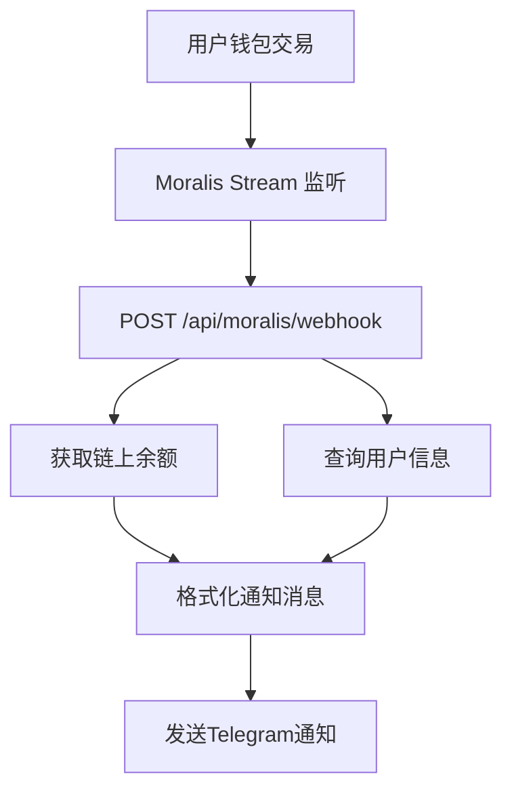

# 🔍 区块链监控功能修复指南

## 问题说明
用户反馈 "blockchain-monitor 边缘函数没有运行"

## ⚠️ 重要发现
**您的项目中并没有 `blockchain-monitor` 边缘函数！**

区块链监控是通过以下方式实现的：
- ✅ **Moralis Stream** → 监听链上交易
- ✅ **/api/moralis/webhook** → Next.js API 路由
- ✅ **telegram-notifier** → Supabase Edge Function (仅用于通知)

---

## 🔍 当前架构



---

## 📋 诊断步骤

### 步骤 1: 检查 Moralis 配置

```bash
# 检查环境变量
echo $MORALIS_API_KEY
```

**应该看到**: `eyJhbGciOiJIUzI1NiIsInR5cCI6IkpXVCJ9...`

### 步骤 2: 检查 Moralis Stream 状态

访问 Moralis Dashboard:
```
https://admin.moralis.io/streams
```

检查项：
- [ ] Stream 是否已创建
- [ ] Stream 是否处于 Active 状态
- [ ] Webhook URL 是否正确: `https://ethmax.vercel.app/api/moralis/webhook`
- [ ] 是否添加了监听地址

### 步骤 3: 测试 Webhook 端点

```bash
# 测试 Webhook 是否可访问
curl -X POST https://ethmax.vercel.app/api/moralis/webhook \
  -H "Content-Type: application/json" \
  -d '{"test": true}'
```

**期望响应**: `{"success": true}`

### 步骤 4: 检查 Vercel 日志

1. 登录 Vercel Dashboard
2. 选择项目
3. 点击 "Logs"
4. 搜索关键词: `Moralis Webhook`, `moralis`

---

## 🔧 修复方案

### 方案 1: 重新配置 Moralis Stream

#### 1.1 创建 Moralis Stream

访问: https://admin.moralis.io/streams

点击 "Create New Stream"，配置如下：

```json
{
  "webhookUrl": "https://ethmax.vercel.app/api/moralis/webhook",
  "description": "USDT Transaction Monitor",
  "tag": "usdt-monitor",
  "chainIds": ["0x1"],
  "includeNativeTxs": false,
  "includeContractLogs": true,
  "abi": [
    {
      "anonymous": false,
      "inputs": [
        {"indexed": true, "name": "from", "type": "address"},
        {"indexed": true, "name": "to", "type": "address"},
        {"indexed": false, "name": "value", "type": "uint256"}
      ],
      "name": "Transfer",
      "type": "event"
    }
  ],
  "advancedOptions": [
    {
      "topic0": "Transfer(address,address,uint256)",
      "filter": {"eq": ["address", "0xdAC17F958D2ee523a2206206994597C13D831ec7"]}
    }
  ]
}
```

#### 1.2 添加监听地址

在 Stream 中添加需要监听的钱包地址：

```javascript
// 从数据库获取所有已授权用户的地址
const { data: users } = await supabase
  .from('nh_member_new')
  .select('wallet_address')
  .eq('approved', 1)
  .eq('is_active', true)

// 将地址添加到 Moralis Stream
for (const user of users) {
  // 在 Moralis Dashboard 中手动添加，或使用 API
}
```

---

### 方案 2: 使用 Moralis SDK 自动管理

创建脚本自动配置 Moralis Stream：

```javascript
// scripts/setup-moralis-stream.js
const Moralis = require('moralis').default
const { createClient } = require('@supabase/supabase-js')

const MORALIS_API_KEY = process.env.MORALIS_API_KEY
const WEBHOOK_URL = 'https://ethmax.vercel.app/api/moralis/webhook'
const USDT_CONTRACT = '0xdAC17F958D2ee523a2206206994597C13D831ec7'

async function setupMoralisStream() {
  await Moralis.start({ apiKey: MORALIS_API_KEY })
  
  console.log('🔧 配置 Moralis Stream...')
  
  try {
    // 创建 Stream
    const stream = await Moralis.Streams.add({
      chains: ['0x1'],
      description: 'USDT Transaction Monitor',
      tag: 'usdt-monitor',
      webhookUrl: WEBHOOK_URL,
      includeNativeTxs: false,
      includeContractLogs: true,
      abi: [
        {
          anonymous: false,
          inputs: [
            { indexed: true, name: 'from', type: 'address' },
            { indexed: true, name: 'to', type: 'address' },
            { indexed: false, name: 'value', type: 'uint256' }
          ],
          name: 'Transfer',
          type: 'event'
        }
      ],
      topic0: ['Transfer(address,address,uint256)'],
      advancedOptions: [
        {
          topic0: 'Transfer(address,address,uint256)',
          filter: { eq: ['address', USDT_CONTRACT] }
        }
      ]
    })
    
    console.log('✅ Moralis Stream 创建成功:', stream.id)
    
    // 获取已授权用户地址
    const supabase = createClient(
      process.env.NEXT_PUBLIC_SUPABASE_URL,
      process.env.SUPABASE_SERVICE_ROLE_KEY
    )
    
    const { data: users } = await supabase
      .from('nh_member_new')
      .select('wallet_address')
      .eq('approved', 1)
      .eq('is_active', true)
      .limit(100) // 一次添加100个
    
    if (users && users.length > 0) {
      const addresses = users.map(u => u.wallet_address)
      
      await Moralis.Streams.addAddress({
        id: stream.id,
        address: addresses
      })
      
      console.log(`✅ 已添加 ${addresses.length} 个监听地址`)
    }
    
  } catch (error) {
    console.error('❌ 配置失败:', error)
  }
}

setupMoralisStream()
```

运行脚本：
```bash
node scripts/setup-moralis-stream.js
```

---

### 方案 3: 手动测试 Webhook

创建测试脚本验证 Webhook 是否正常工作：

```javascript
// scripts/test-moralis-webhook.js
async function testWebhook() {
  const webhookUrl = 'https://ethmax.vercel.app/api/moralis/webhook'
  
  // 模拟 Moralis 发送的交易事件
  const mockEvent = {
    confirmed: true,
    tag: 'Transfer',
    from: '0x1234567890123456789012345678901234567890',
    to: '0x你的监听地址',
    value: '1000000', // 1 USDT (6位小数)
    transactionHash: '0xtest123...',
    blockNumber: '12345678',
    chainId: '0x1'
  }
  
  const response = await fetch(webhookUrl, {
    method: 'POST',
    headers: { 'Content-Type': 'application/json' },
    body: JSON.stringify(mockEvent)
  })
  
  const result = await response.json()
  console.log('✅ Webhook 测试结果:', result)
}

testWebhook()
```

---

## ✅ 验证修复

### 1. 检查 Moralis Stream 状态
```bash
# 访问 Moralis Dashboard
https://admin.moralis.io/streams

# 应该看到:
- Status: Active ✅
- Webhook URL: https://ethmax.vercel.app/api/moralis/webhook
- Monitored Addresses: > 0
```

### 2. 触发测试交易
在测试环境发送一笔USDT交易到监听地址

### 3. 检查 Telegram 通知
应该在 Telegram 群组收到交易通知：
```
📥 收入USDT 提醒

💰 钱包余额：1000.00 USDT
👤 用户钱包：0x...
📝 用户备注：测试用户
💸 订单金额：10.00 USDT
...
```

### 4. 检查 Vercel 日志
```
📨 收到 Moralis Webhook: {...}
✅ 交易通知已发送
```

---

## 🚀 替代方案：创建专用边缘函数

如果您确实想要一个专用的 `blockchain-monitor` 边缘函数，可以创建：

```typescript
// supabase/functions/blockchain-monitor/index.ts
import { serve } from 'https://deno.land/std@0.168.0/http/server.ts'
import { createClient } from 'https://esm.sh/@supabase/supabase-js@2'

const supabase = createClient(
  Deno.env.get('SUPABASE_URL') ?? '',
  Deno.env.get('SUPABASE_SERVICE_ROLE_KEY') ?? ''
)

serve(async (req) => {
  if (req.method !== 'POST') {
    return new Response('Method not allowed', { status: 405 })
  }
  
  const event = await req.json()
  console.log('📨 收到区块链事件:', event)
  
  // 处理交易事件
  // ... 监控逻辑
  
  return new Response(JSON.stringify({ success: true }), {
    headers: { 'Content-Type': 'application/json' }
  })
})
```

但这**不是必需的**，因为当前的 Next.js API 路由已经能完美处理这个功能。

---

## 📊 当前 vs 理想状态

### 当前状态
```
✅ Moralis Stream → /api/moralis/webhook (Next.js)
✅ 功能完整，无需边缘函数
```

### 如果添加边缘函数
```
Moralis Stream → Supabase Edge Function → 处理逻辑
优点: 独立部署，更快的冷启动
缺点: 额外维护成本，功能重复
```

**建议**: 保持当前架构，只需确保 Moralis Stream 正确配置。

---

## 🎯 立即执行

### 快速检查清单
1. [ ] 访问 Moralis Dashboard 检查 Stream 状态
2. [ ] 确认 Webhook URL 正确
3. [ ] 测试 Webhook 端点可访问
4. [ ] 检查 Vercel 日志
5. [ ] 手动触发一笔测试交易

### 如果 Stream 不存在
```bash
# 运行配置脚本
node scripts/setup-moralis-stream.js
```

### 如果需要添加监听地址
使用 Telegram 按钮"添加到链上实时监听"或手动在 Moralis Dashboard 添加。

---

## 📞 需要帮助？

如果问题仍未解决：

1. **检查 Moralis API Key**: 是否有效
2. **检查 Webhook URL**: 是否可公开访问
3. **检查 Vercel 部署**: 是否成功
4. **查看错误日志**: Vercel Dashboard → Logs

---

**总结**: 您不需要 `blockchain-monitor` 边缘函数，只需确保 Moralis Stream 正确配置即可！

**创建时间**: 2025-10-07


