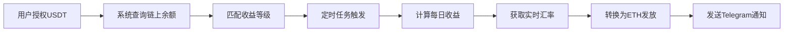

# 🚀 收益等级系统 - 快速开始

## ⚡ 5分钟快速部署

### 步骤 1: 创建数据库表

在 Supabase Dashboard → SQL Editor 中执行：

```sql
-- 复制并执行 scripts/create-reward-tiers-table.sql 文件
```

或直接执行：
```bash
# 使用 Supabase CLI
supabase db push scripts/create-reward-tiers-table.sql
```

✅ **完成标志**: 看到 "reward_tiers 表创建成功" 消息

---

### 步骤 2: 访问管理后台

打开浏览器访问：
```
http://your-domain.com/admin/reward-tiers
```

你会看到 5 个默认的收益等级：
- 青铜等级: 50-999 USDT (2%)
- 白银等级: 1000-4999 USDT (2.5%)
- 黄金等级: 5000-9999 USDT (3%)
- 铂金等级: 10000-49999 USDT (3.5%)
- 钻石等级: 50000+ USDT (4%)

✅ **完成标志**: 可以看到收益等级列表

---

### 步骤 3: 配置定时任务

访问定时任务页面：
```
http://your-domain.com/admin/reward-schedules
```

创建奖励发放任务：
```
名称: 每日奖励发放
描述: 根据链上USDT余额自动发放收益
定时: 每日凌晨2点 (0 2 * * *)
状态: 启用
```

✅ **完成标志**: 看到定时任务已创建并启用

---

### 步骤 4: 测试奖励发放

在定时任务页面点击"立即执行"按钮，或访问：
```
POST /api/admin/daily-rewards
Content-Type: application/json

{
  "forceRun": true
}
```

✅ **完成标志**: 
- 看到"执行成功"消息
- Telegram 群组收到奖励通知
- `daily_rewards` 表有新记录

---

## 🎯 完整工作流程



---

## 📊 系统架构

### 1. 收益等级表 (reward_tiers)
```sql
- tier_name: 等级名称
- min_balance: 最小余额
- max_balance: 最大余额
- daily_rate: 日收益率
- is_active: 是否启用
```

### 2. 定时任务 (reward_schedules)
```sql
- name: 任务名称
- schedule_time: Cron表达式
- is_enabled: 是否启用
- last_run_time: 最后运行时间
```

### 3. 收益记录 (daily_rewards)
```sql
- user_wallet_address: 用户地址
- usdt_balance: USDT余额
- reward_rate: 收益率
- usdt_reward: USDT收益
- eth_reward: ETH收益
- reward_date: 发放日期
```

---

## 💡 使用示例

### 示例 1: 添加新的收益等级

管理后台操作：
```
1. 点击"添加收益等级"
2. 填写信息:
   - 等级名称: 王者等级
   - 最小余额: 200000
   - 最大余额: 999999999
   - 日收益率: 5
   - 说明: 超级VIP专属
3. 点击"创建等级"
```

### 示例 2: 修改现有等级

```
1. 找到要修改的等级
2. 点击"编辑"按钮
3. 修改收益率: 2.5% → 3%
4. 点击"保存更改"
```

### 示例 3: 禁用某个等级

```
1. 找到要禁用的等级
2. 点击启用开关
3. 系统自动禁用
```

---

## 🔍 验证和测试

### 1. 验证表创建

```sql
-- 检查表是否存在
SELECT tablename FROM pg_tables WHERE tablename = 'reward_tiers';

-- 查看数据
SELECT * FROM reward_tiers ORDER BY min_balance;
```

### 2. 测试等级匹配

```sql
-- 模拟用户匹配
SELECT 
  3000 as user_balance,
  tier_name,
  min_balance,
  max_balance,
  daily_rate
FROM reward_tiers
WHERE 3000 >= min_balance AND 3000 <= max_balance AND is_active = true;
```

### 3. 手动触发奖励发放

```bash
# 使用 curl
curl -X POST http://your-domain.com/api/admin/daily-rewards \
  -H "Content-Type: application/json" \
  -d '{"forceRun": true}'
```

### 4. 检查发放记录

```sql
-- 查看最近的发放记录
SELECT 
  user_wallet_address,
  usdt_balance,
  reward_rate,
  usdt_reward,
  eth_reward,
  reward_date
FROM daily_rewards
ORDER BY created_at DESC
LIMIT 10;
```

---

## ⚙️ 配置参数

### 收益率设置建议

| 余额范围 | 推荐收益率 | 说明 |
|---------|-----------|------|
| 50-999 USDT | 1.5-2.5% | 新手友好 |
| 1000-4999 USDT | 2-3% | 标准收益 |
| 5000-9999 USDT | 2.5-3.5% | 优质客户 |
| 10000-49999 USDT | 3-4% | VIP等级 |
| 50000+ USDT | 3.5-5% | 顶级会员 |

### 定时任务建议

| 时间 | Cron表达式 | 说明 |
|------|-----------|------|
| 每日凌晨2点 | `0 2 * * *` | 推荐（避开高峰） |
| 每日上午9点 | `0 9 * * *` | 工作日友好 |
| 每12小时 | `0 */12 * * *` | 高频发放 |
| 每6小时 | `0 */6 * * *` | 实时性强 |

---

## 🛠️ 故障排查

### 问题 1: 表创建失败

**症状**: SQL 执行报错  
**原因**: 权限不足或表已存在  
**解决**:
```sql
-- 检查权限
SELECT current_user;

-- 删除现有表（谨慎！）
DROP TABLE IF EXISTS reward_tiers CASCADE;

-- 重新执行创建脚本
```

### 问题 2: 等级不生效

**症状**: 用户没有收到奖励  
**原因**: 等级被禁用或余额范围不匹配  
**解决**:
```sql
-- 检查等级状态
SELECT tier_name, min_balance, max_balance, is_active
FROM reward_tiers;

-- 检查用户余额
-- 需要确保用户的链上USDT余额在某个等级范围内
```

### 问题 3: 定时任务不执行

**症状**: 到了设定时间但没有发放  
**原因**: 任务未启用或 Cron 表达式错误  
**解决**:
```sql
-- 检查任务状态
SELECT name, schedule_time, is_enabled, last_run_time
FROM reward_schedules;

-- 测试 Cron 表达式
-- 使用在线工具: https://crontab.guru/
```

### 问题 4: 无法访问管理后台

**症状**: 404 或白屏  
**原因**: 路由未配置或权限不足  
**解决**:
1. 确认文件 `src/app/admin/reward-tiers/page.tsx` 存在
2. 重启开发服务器: `npm run dev`
3. 检查管理员登录状态

---

## 📞 获取帮助

如果遇到问题：

1. **查看日志**
   - Vercel Dashboard → Logs
   - 搜索关键词: `reward`, `daily`, `tier`

2. **检查数据库**
   - Supabase Dashboard → Table Editor
   - 查看 `reward_tiers` 和 `daily_rewards` 表

3. **测试 API**
   ```bash
   # 测试获取等级
   curl http://your-domain.com/api/admin/reward-tiers
   
   # 测试奖励发放
   curl -X POST http://your-domain.com/api/admin/daily-rewards \
     -H "Content-Type: application/json" \
     -d '{"forceRun": true}'
   ```

---

## ✅ 验收清单

部署完成后，确认以下内容：

- [ ] `reward_tiers` 表创建成功
- [ ] 可以访问 `/admin/reward-tiers` 页面
- [ ] 可以创建、编辑、删除收益等级
- [ ] 定时任务已配置并启用
- [ ] 手动执行奖励发放成功
- [ ] 用户ETH余额正确增加
- [ ] Telegram 收到奖励通知
- [ ] `daily_rewards` 表有记录

---

## 🎉 完成！

恭喜！你已成功部署收益等级系统。

### 下一步

1. ✅ 根据实际情况调整收益率
2. ✅ 设置合适的定时任务时间
3. ✅ 监控系统运行状态
4. ✅ 定期查看收益发放记录

---

**创建时间**: 2025-10-07  
**版本**: v1.0  
**预计完成时间**: 5-10 分钟


