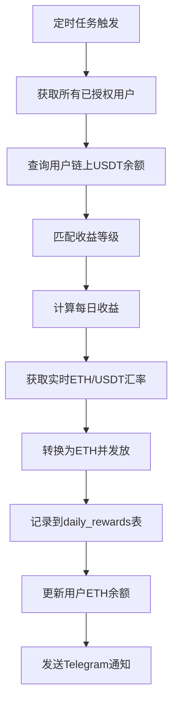

# 🎯 收益等级设置系统

## 📋 概述

收益等级系统用于管理基于用户链上USDT余额的定时奖励发放，系统会根据用户钱包的实际USDT余额自动匹配对应的收益等级，并按照设定的比例发放ETH奖励。

---

## 🗄️ 数据库表结构

### reward_tiers 表

```sql
CREATE TABLE IF NOT EXISTS reward_tiers (
  id UUID DEFAULT gen_random_uuid() PRIMARY KEY,
  tier_name TEXT NOT NULL,
  min_balance NUMERIC(20, 6) NOT NULL DEFAULT 0,
  max_balance NUMERIC(20, 6) NOT NULL DEFAULT 999999999,
  daily_rate NUMERIC(10, 6) NOT NULL DEFAULT 0.02,
  description TEXT,
  is_active BOOLEAN DEFAULT true,
  created_at TIMESTAMPTZ DEFAULT NOW(),
  updated_at TIMESTAMPTZ DEFAULT NOW(),
  
  CONSTRAINT check_balance_range CHECK (max_balance >= min_balance),
  CONSTRAINT check_daily_rate CHECK (daily_rate >= 0 AND daily_rate <= 1)
);

-- 创建索引
CREATE INDEX idx_reward_tiers_balance ON reward_tiers(min_balance, max_balance);
CREATE INDEX idx_reward_tiers_active ON reward_tiers(is_active);

-- 添加注释
COMMENT ON TABLE reward_tiers IS '收益等级配置表';
COMMENT ON COLUMN reward_tiers.tier_name IS '等级名称';
COMMENT ON COLUMN reward_tiers.min_balance IS '最小USDT余额';
COMMENT ON COLUMN reward_tiers.max_balance IS '最大USDT余额';
COMMENT ON COLUMN reward_tiers.daily_rate IS '日收益率（小数形式，如0.02表示2%）';
COMMENT ON COLUMN reward_tiers.description IS '等级说明';
COMMENT ON COLUMN reward_tiers.is_active IS '是否启用';
```

### 插入默认数据

```sql
-- 插入默认的收益等级
INSERT INTO reward_tiers (tier_name, min_balance, max_balance, daily_rate, description, is_active) VALUES
('青铜等级', 50, 999, 0.02, '50-999 USDT，日收益率2%', true),
('白银等级', 1000, 4999, 0.025, '1000-4999 USDT，日收益率2.5%', true),
('黄金等级', 5000, 9999, 0.03, '5000-9999 USDT，日收益率3%', true),
('铂金等级', 10000, 49999, 0.035, '10000-49999 USDT，日收益率3.5%', true),
('钻石等级', 50000, 999999999, 0.04, '50000+ USDT，日收益率4%', true);
```

---

## 🔄 工作流程

### 1. 收益等级匹配

系统会根据用户钱包的**链上实际USDT余额**自动匹配收益等级：

```
用户链上USDT余额: 3000 USDT
↓
匹配规则: min_balance <= 3000 <= max_balance
↓
匹配到: 白银等级 (1000-4999 USDT)
↓
日收益率: 2.5%
↓
每日收益: 3000 × 0.025 = 75 USDT
```

### 2. 奖励发放流程



### 3. 完整示例

```javascript
// 1. 用户信息
const user = {
  wallet_address: '0x1234...5678',
  approved: 1,  // 已授权
  is_active: true
}

// 2. 查询链上USDT余额
const usdtBalance = await getUserChainBalance(user.wallet_address)
// 结果: 8000 USDT

// 3. 匹配收益等级
const tier = await getRewardTier(usdtBalance)
// 结果: {
//   tier_name: '黄金等级',
//   min_balance: 5000,
//   max_balance: 9999,
//   daily_rate: 0.03
// }

// 4. 计算收益
const usdtReward = usdtBalance * tier.daily_rate
// 结果: 8000 × 0.03 = 240 USDT/天

// 5. 获取实时汇率
const exchangeRate = await getExchangeRate()
// 结果: 1 USDT = 0.0003 ETH (假设ETH价格为$3333)

// 6. 转换为ETH
const ethReward = usdtReward * exchangeRate.usdtToEth
// 结果: 240 × 0.0003 = 0.072 ETH

// 7. 发放奖励
await supabase
  .from('nh_member_new')
  .update({
    a_eth: supabase.raw(`a_eth + ${ethReward}`),  // 总产量
    eth: supabase.raw(`eth + ${ethReward}`)       // 可兑换余额
  })
  .eq('wallet_address', user.wallet_address)
```

---

## 🎮 管理后台使用

### 访问路径

```
http://your-domain.com/admin/reward-tiers
```

### 功能列表

#### 1. 查看收益等级列表
- 显示所有已配置的收益等级
- 查看等级名称、余额范围、收益率
- 查看等级启用状态

#### 2. 创建新等级
```
点击"添加收益等级"按钮
↓
填写等级信息:
  - 等级名称: 超级会员
  - 最小余额: 100000 USDT
  - 最大余额: 999999999 USDT (表示无上限)
  - 日收益率: 5%
  - 说明: VIP专属等级
↓
系统验证:
  - 余额范围是否有效
  - 是否与现有等级冲突
↓
创建成功
```

#### 3. 编辑等级
- 点击"编辑"按钮
- 修改等级参数
- 系统自动验证冲突

#### 4. 启用/禁用等级
- 使用开关快速启用或禁用
- 禁用后不会参与匹配

#### 5. 删除等级
- 点击"删除"按钮
- 确认后永久删除

---

## 📊 数据统计

管理后台会显示以下统计数据：

### 1. 总等级数
- 系统中配置的所有收益等级数量

### 2. 活跃等级
- 当前启用的等级数量

### 3. 平均收益率
- 所有等级的平均日收益率

---

## 💡 使用建议

### 1. 等级设置策略

#### 合理的等级划分
```
青铜: 50-999 USDT (2%)
白银: 1000-4999 USDT (2.5%)
黄金: 5000-9999 USDT (3%)
铂金: 10000-49999 USDT (3.5%)
钻石: 50000+ USDT (4%)
```

#### 避免的设置
```
❌ 等级间有间隙
青铜: 50-999
白银: 2000-4999  // 1000-1999 USDT的用户无法匹配

❌ 等级重叠
青铜: 50-1500
白银: 1000-5000  // 1000-1500 USDT重叠

✅ 正确设置
青铜: 50-999
白银: 1000-4999  // 完美衔接
```

### 2. 收益率设置

#### 考虑因素
- 📈 **市场竞争力**: 参考同类产品收益率
- 💰 **资金成本**: 确保可持续发放
- 🎯 **用户激励**: 鼓励增加质押金额
- ⚖️ **风险控制**: 避免过高承诺

#### 推荐范围
```
低等级: 1.5% - 2.5%
中等级: 2.5% - 3.5%
高等级: 3.5% - 5%
```

### 3. 定时任务配置

在"定时任务"页面设置发放时间：

```
推荐设置:
- 每日凌晨 2:00 执行
- Cron表达式: 0 2 * * *

优点:
- 避开用户使用高峰
- 减少服务器负载
- 统一结算时间
```

---

## 🔍 常见问题

### Q1: 用户余额在两个等级边界怎么办？

**A**: 系统会匹配到包含该余额的等级。

```sql
-- 示例: 用户有1000 USDT
白银等级: min_balance = 1000, max_balance = 4999
匹配条件: 1000 >= 1000 AND 1000 <= 4999
结果: ✅ 匹配成功
```

### Q2: 如果没有匹配的等级会怎样？

**A**: 系统会使用最低等级，或跳过该用户。

```javascript
// 如果余额 < 所有等级的min_balance
if (usdtBalance < 50) {
  console.log('余额不足，跳过')
  continue
}
```

### Q3: 修改收益率会影响已发放的奖励吗？

**A**: 不会。每次发放都会记录当时的收益率。

```sql
-- daily_rewards 表会记录
INSERT INTO daily_rewards (
  user_wallet_address,
  usdt_balance,
  reward_rate,  -- 记录发放时的收益率
  usdt_reward,
  eth_reward,
  reward_date
)
```

### Q4: 如何测试新的等级设置？

**A**: 使用管理后台的"立即执行"功能。

```
路径: 管理后台 → 定时任务 → 点击"执行"按钮
效果: 立即触发一次奖励发放
用途: 测试新的等级配置是否正常工作
```

---

## 🚀 部署步骤

### 1. 创建数据库表

在 Supabase SQL Editor 中执行：

```sql
-- 见上方"数据库表结构"部分的SQL
```

### 2. 插入默认数据

```sql
-- 见上方"插入默认数据"部分的SQL
```

### 3. 验证表创建

```sql
-- 查询表是否创建成功
SELECT * FROM reward_tiers;

-- 查询索引
SELECT indexname, indexdef 
FROM pg_indexes 
WHERE tablename = 'reward_tiers';
```

### 4. 更新管理后台导航

在管理后台添加"收益等级设置"菜单项。

### 5. 测试功能

1. 访问 `/admin/reward-tiers`
2. 创建测试等级
3. 在定时任务中执行一次奖励发放
4. 检查 `daily_rewards` 表的记录

---

## 📈 监控和维护

### 1. 定期检查

```sql
-- 检查活跃等级
SELECT tier_name, min_balance, max_balance, daily_rate, is_active
FROM reward_tiers
WHERE is_active = true
ORDER BY min_balance;

-- 检查等级使用情况
SELECT 
  rt.tier_name,
  COUNT(DISTINCT dr.user_wallet_address) as user_count,
  SUM(dr.usdt_reward) as total_usdt_reward,
  SUM(dr.eth_reward) as total_eth_reward
FROM reward_tiers rt
LEFT JOIN daily_rewards dr ON 
  dr.usdt_balance >= rt.min_balance AND 
  dr.usdt_balance <= rt.max_balance
WHERE rt.is_active = true
GROUP BY rt.tier_name
ORDER BY rt.min_balance;
```

### 2. 性能优化

```sql
-- 添加额外索引（如果查询慢）
CREATE INDEX idx_daily_rewards_balance ON daily_rewards(usdt_balance);
CREATE INDEX idx_daily_rewards_date ON daily_rewards(reward_date);
```

---

## ✅ 总结

**完成后你将拥有**：
- ✅ 灵活的收益等级管理系统
- ✅ 基于真实链上余额的奖励发放
- ✅ 直观的管理后台界面
- ✅ 自动化的定时奖励发放
- ✅ 完整的收益记录追踪

**系统特点**：
- 🔄 自动匹配用户等级
- 💰 实时汇率转换
- 📊 详细的数据统计
- 🛡️ 完善的冲突检测
- 📱 Telegram 实时通知

---

**创建时间**: 2025-10-07  
**版本**: v1.0


